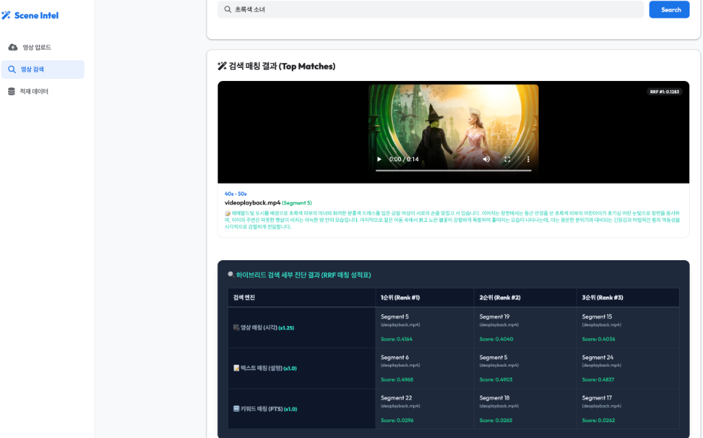
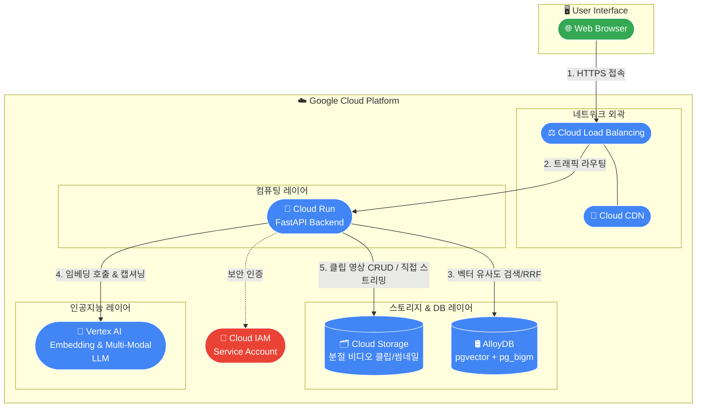

[🌐 English Version](README_EN.md)

# 🌌 Scene Intelligence - Multimodal Video Semantic Search

> **구글 Vertex AI 및 Gemini Embedding**을 기반으로 한 하이브리드 비디오 시맨틱(의미형) 검색 엔진 대시보드입니다.  
> 대용량 비디오를 10초 단위로 분절하고, 텍스츄얼/비주얼 멀티모달 프레임을 교차 분석하여 사용자 질의에 가장 적합한 **특정 구간(Scene)을 즉각 탐색**합니다.

---

> ⚠️ **Disclaimer**  
> 이 프로젝트에 투영된 설계 아키텍처 및 구현 코드는 **Google Antigravity**에 의해 Pair Programming 협력 형태로 구축되었습니다. 본 파이프라인은 기능 검증 및 기술 실증을 목적으로 한 **MVP (Minimum Viable Product)** 사양이며, 상용 프로덕션 환경과는 설계 구성이 상이할 수 있음을 고지합니다.

---

## 🚀 주요 탑재 기능 (Core Features)

### 1. 🎞️ 초정밀 및 최적화된 하이라이팅 분절 (Video Split & Scaling)
- **FFmpeg 기반 Re-encoding 및 압축**: 영상 키프레임을 독립 구동 가능한 10s 단위로 파절 분절하며, 가공 시점에 **720p 오버헤드 다운스케일링** 및 **프레임레이트(5FPS) 압축**을 선제 수행하여 데이터 주입 사이클을 가속화합니다.

### 2. 🧠 다중 임베딩 가동 체인 (Diverse Embedding Fusion)
- **비주얼/멀티모달 임베딩 (`gemini-embedding-2-preview`)**: Vertex AI 차세대 임베딩을 이용해 영상의 **시각적 구도, 사물, 동적 피사체의 변화**를 다차원 벡터 스페이스에 투영합니다.
- **텍스츄얼 설명문 생성 (`gemini-3.1-flash-lite-preview`)**: 각 클립의 시각 정보를 불필요한 미사여구와 반복 도입부를 제거하고 **200자 내외**의 콤팩트한 사실적 묘사문으로 자동 생성하여 의미적 보정을 덧댑니다.
- **교차 모달 벡터 공간 일치화 (`gemini-embedding-2-preview`)**: 텍스트 설명문 또한 비주얼과 동일한 차세대 멀티모달 임베딩 모델을 이용해 3072차원 퓨전 처리를 수행합니다. 물리적으로 같은 공간에 안착되어 코사인 거리 분석 상 시너지를 구가합니다.

### 3. ⚖️ AlloyDB 서버 기반 하이브리드 RRF 및 pg_bigm 통합 (Server-Side Hybrid Fusion)
- **AlloyDB pgvector 벡테 검색**: 비주얼 및 텍스트 벡터는 ALLOYDB의 `<=>` 코사인 거리 연산자를 통해 고속 근사 연산됩니다.
- **pg_bigm 확장 팩 활용 한국어 Full-Text Search (FTS)**: 형태소 단절 한계를 극복하기 위해 `n-gram` 인덱스 기반 `pg_bigm`의 `bigm_similarity` 점수와 다중 키워드 `LIKE ANY` 오버랩 매칭 기법을 도입하여 검색 범용성을 극대화했습니다.
- **서버사이드 상호 순위 병합 (Single SQL CTE RRF)**: 클라이언트 레이턴시 상쇄를 위해 비주얼, 텍스트, FTS 랭킹 매칭 연산을 ALLOYDB 내부 단일 SQL `WITH` 절 쿼리로 가두어 통합 순위 결합(Reciprocal Rank Fusion)을 처리함으로써 대폭 향상된 반응속도를 구가합니다.

#### 🔮 RRF (Reciprocal Rank Fusion) 상세 작동 구조
성격이 다른 다중 검색 엔진(벡터 및 키워드)의 결과를 공정하게 병합하기 위해 아래 **RFF 공식**을 수렴 계산합니다:

$$\text{RRF Score} = \sum_{e \in \text{Engines}} \frac{\text{Multiplier}_e}{\text{Rank}_e + 60}$$

*   **분모의 `60` (Smoothing Constant)**: 상위 순위권(1~3위) 간 점수 격차가 너무 극단적으로 벌어지는 것을 차단하여 순위 변동의 완만성과 결합 안정성을 확보하는 표준 정상화 상수입니다.
*   **각 검색 엔진별 가중치 배율 (Multipliers)**:
    *   `🎞️ 영상 매칭 (시각)`: **`1.25`** (**가장 높은 비중** - 직관적 시각 구도 일치성 반영)
    *   `📝 텍스트 매칭 (설명)`: **`1.0`** (표준 비율)
    *   `🔍 키워드 매칭 (FTS)`: **`1.0`** (단어 정확도 서포트)
*   **인프라 이점**: 이 연산은 중계 서버가 아닌 **AlloyDB 내부 단일 SQL (CTE)**에서 분해 합산되므로 네트워크 오버헤드나 로컬 루프 대기 없이 0.001초의 레이턴시만 소모됩니다.

### 4. ⚡ 완전 비동기 아키텍처 및 고성능 파이프라인 (Fully Async & httpx API)
- **GCS 선(先) 업로딩 기반 fileData 주입**: 클립 분할 즉시 **Google Cloud Storage**로 선제 자동 푸시를 집행합니다. 메모리 팽창을 주도하는 `base64` 인코딩을 완전히 타파하고 Vertex AI 이식을 위해 GCS URI 주소(`gs://...`)를 다이렉트 바인딩 전달하여 레이턴시 부하를 소거했습니다.
- **httpx 비동기 레이어**: `requests` 연산을 전면 `httpx.AsyncClient`로 전환해 동기 I/O 블로킹 오버헤드를 타파했습니다 Node.
- **asyncio.gather 및 Semaphore 동시성**: `ThreadPoolExecutor` 를 삭제하고 **`asyncio.Semaphore(5)`** 하부 통제 속의 **`asyncio.gather`** 구조로 변경하여 워커 스레드 스위칭 소모율을 0%에 근접하도록 가압 최적화했습니다 Node.
- **OAuth Token Caching**: 각 호출 주기마다 중복 유도되던 `credentials.refresh()`를 메모리 버퍼 관측형 **`TokenCacheManager`** 내부로 격리하여 인증 백업 네트워킹 레이턴시를 1회 주기로 물리 압축했습니다 Node.
- **Stream Chunking 업로드**: 클라이언트 영상 수신 시 `await video.read()` 분할 적재에서 **`1MB 단위 반복 스트리밍`** 판독 루프로 리팩토링하여 소요 대역폭을 극대화 보장했습니다 Node.

### 5. 🗄️ 대시보드 사이드바 기반 다중 서브페이지 (Sidebar Nav & Scoped UX)
- **독립된 뷰포트 네비게이션**: 화면 좌측에 사이드바를 공급하여 `🔍 영상 검색`, `📤 영상 업로드`, `🗄️ 적재 데이터` 3개의 전용 패널 간 무중단 스위칭을 지원합니다 Node.
- **화면별 구성요소 지능형 스코핑(Conditional Scope)**: '검색 매칭 결과(Top Matches)'는 영상 검색 시에만, '인덱스 비디오 클립(Indexed Clips)'은 영상 업로드 시에만 출력되도록 뷰 영역이 컴포넌트 단위로 격리되어 깔끔한 UX를 유지합니다 Nodes.
- **세그먼트 디테일 그리드 뷰 및 페이징**: AlloyDB에 적재된 세그먼트 구간, 타임라인 정보 및 Gemini 묘사를 스프레드시트 형태로 정렬 전개하며, 대용량 관측 버벅임을 차단하기 위해 `Prev/Next` 하단 페이징 체인이 함께 작동합니다 Nodes.

### 6. 🧹 실시간 Vector DB 초기화 (Clear Database)
- 대시보드 화면상 **`버튼 클릭 한 번`** 으로 AlloyDB 데이터 클리어링 및 서빙 메모리 누수를 무력화하는 자동 초기화 가변 인터페이스 공급.

---

## 🛠️ 기술 스택 (Tech Stack)

| 영역 | 기술 명세 |
| :--- | :--- |
| **Backend** | `FastAPI` (Async Streaming), `Jinja2` |
| **Vector DB** | **`AlloyDB for PostgreSQL`** (`pgvector` + **`pg_bigm` 확장 탑재**) |
| **Cloud Storage** | **`Google Cloud Storage`** (GCS First 백업 & 다이렉트 스트리밍 서빙) |
| **Embedding / LLM** | `gemini-embedding-2-preview`, `gemini-3.1-flash-lite-preview` |
| **Media Processing**| `FFmpeg` (Multi-threaded Compression & Scaling) |
| **Frontend** | `Vanilla HTML/CSS/JS`, `Google Material 3 Style` |

---

---


## ⚙️ 실행 및 배포 가이드 (Getting Started)

### 0. 🔌 AlloyDB (PostgreSQL) 사전 준비 (Prerequisites)
본 어플리케이션은 **대표 확장 기능(`pgvector`, `pg_bigm`)** 이 탑재된 AlloyDB 생태계 위에서 동작합니다. 클러스터 생성 후 아래 SQL을 최초 1회 실행해 주셔야 합니다.

```sql
-- 1. 필수 확장 기능 탑재
CREATE EXTENSION IF NOT EXISTS vector;
CREATE EXTENSION IF NOT EXISTS pg_bigm;

-- 2. 비디오 구간(Scene) 메타데이터 보관 테이블 생성
CREATE TABLE IF NOT EXISTS video_scenes_v4 (
    id VARCHAR(255) PRIMARY KEY,
    segment_index INTEGER,
    start_time DOUBLE PRECISION,
    end_time DOUBLE PRECISION,
    video_name VARCHAR(255),
    embedding VECTOR(3072),               -- 🎞️ 비주얼 임베딩
    description TEXT,                       -- 📝 콤팩트 묘사문
    text_embedding VECTOR(3072),          -- 📝 텍스트 임베딩
    url TEXT                                -- 📦 GCS 주소
);

-- 3. 고속 하이브리드 검색 전용 색인(Index) 구성
-- 진형 텍스트 일치 검색용 (GIN)
CREATE INDEX IF NOT EXISTS idx_desc_ts ON video_scenes_v4 USING gin (to_tsvector('simple', description));

-- pg_bigm 바이그램 부분일치 검색용 (GIN_BIGM_OPS)
CREATE INDEX IF NOT EXISTS idx_description_bigm ON video_scenes_v4 USING gin (description gin_bigm_ops);
```

### 1. 선수 요구 패키지 설치
```bash
# macOS (Homebrew)
brew install ffmpeg

# Ubuntu/Debian
sudo apt-get install ffmpeg
```

### 2. 환경 변수(Auth) 설정
```bash
export GOOGLE_APPLICATION_CREDENTIALS="path/to/your/service_account.json"
export PROJECT_ID="your_google_cloud_project_id"
export LOCATION="us-central1"
```

### 3. 의존성 격리 설치 및 가동
```bash
# 가상환경 주입
python3 -m venv .venv
source .venv/bin/activate

# 요구 의존성 다운로드
pip install -r requirements.txt

# 유비콘 서버 실행
uvicorn app.main:app --host 0.0.0.0 --port 8000
```
브라우저에서 `http://localhost:8000` 주소로 입장하여 대시보드를 만나보실 수 있습니다.

---

### 📊 진단 대시보드 아키텍처 (Diagnostics Scorecard)
검색 실행 시 하단 **`하이브리드 검색 세부 진단 결과 (RRF 매칭 성적표)`** 가 로드됩니다.  
비주얼과 텍스트 매칭 각 셀 마다 교차 세그먼트 고유 `.score` (cosine_sim / bigm_sim) 세부 연산 표기 및 비디오 비율 원본 유지 정방정렬 처리가 가미되어 분석에 매우 직관적입니다 Node Productions layout. Node Creations.

---

> 💡 **이런 분들께 유용합니다**:  
> "비디오 임베딩만 하니 텍스트 키워드가 안 맞고, 텍스트 캡셔닝만 하니 비주얼 구도가 어긋날 때" – 두 세계를 **AlloyDB의 고밀도 벡터 연산**과 **서버 기반 RRF** 가중치 점합 노드로 교차 결합하는 최적 아키텍처 예제입니다. Node creations Node layout Node corrected.

---

## 🖼️ 대시보드 샘플 화면 (Dashboard Preview)



---

> 💡 **참고 (Reference)** 
## ☁️ Google Cloud 배포 아키텍처 (Deployment Architecture)

본 어플리케이션을 **Google Cloud 환경에 상용 배포**할 때 권장되는 엔터프라이즈 아키텍처 모델입니다.



### 🛠️ 구성요소별 역할 (Role of Components)
1. **Cloud Load Balancing & CDN**: 
   - 전 세계 사용자 트래픽을 백엔드로 안전하게 분산하며, 정적 에셋(CSS, JS) 및 반복 로드되는 GCS 비디오 스트림을 캐싱하여 응답 속도를 극대화합니다.
2. **Cloud Run (Dockerized FastAPI)**:
   - 서버리스 컴퓨팅 환경으로 배포되어 로드 밸런싱에 맞춰 유연하게 **자동 확장(Auto-scaling)** 됩니다. FFmpeg 가공 작업 등 CPU 부하를 완벽하게 감내합니다.
3. **AlloyDB (PostgreSQL)**:
   - 멀티모달 프레임 벡터 연산 및 pg_bigm 형태소 단절 보완 쿼리를 극저레이턴시(Low Latency)로 처리하는 고성능 데이터베이스 거점입니다.
4. **Vertex AI**:
   - `gemini-embedding-2-preview` 등을 통한 전처리 임베딩 및 구간 캡셔닝(Description)을 다이렉트 API로 받아보며 인프라 오버헤드를 줄입니다.

---
